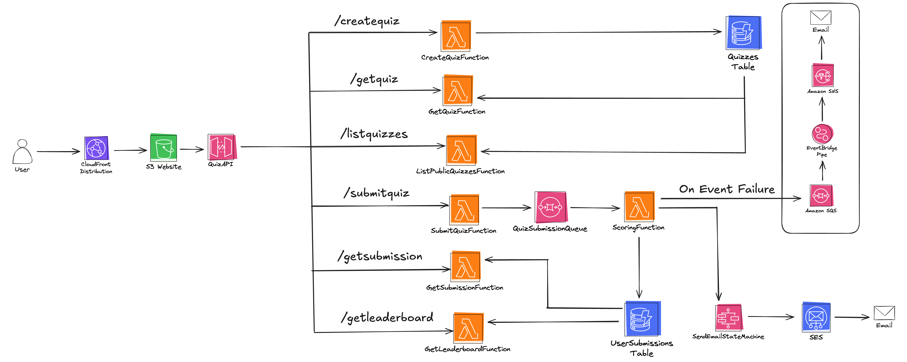

# Developing & testing Serverless Quiz App with LocalStack's Platform features

| Key          | Value                                                                                |
| ------------ | ------------------------------------------------------------------------------------ |
| Environment  | LocalStack, AWS                                                                      |
| Services     | DynamoDB, SQS, Lambda, API Gateway, SNS, EventBridge, Step Functions, CloudFront, S3 |
| Integrations | AWS CDK, AWS SDK, pytest, GitHub Actions                                             |
| Categories   | Serverless, Event-Driven Architecture                                                |
| Level        | Advanced                                                                             |
| Use Case     | Cloud Emulation, Resource Browsers, Chaos Engineering, Cloud Pods, Integration Testing, IAM Policy Stream, Ephemeral Instances, Extensions                                       |
| GitHub       | [Repository link](https://github.com/localstack-samples/sample-serverless-quiz-app)         |

## Introduction

This sample demonstrates how to build a fully serverless quiz application that showcases LocalStack's comprehensive platform capabilities for local cloud development, debugging, and testing throughout the entire software development lifecycle (SDLC). Starting from a simple idea of creating interactive quizzes, the application evolves into a sophisticated demonstration of event-driven serverless architecture, complete with user submissions, scoring mechanisms, and leaderboards. To test this application sample, we will demonstrate how you use LocalStack to deploy complex serverless infrastructure on your developer machine, leverage advanced LocalStack features like Cloud Pods and Chaos Engineering, and validate the complete workflow locally with comprehensive testing and monitoring capabilities.

**NOTE**: This application showcases LocalStack's advanced platform features and serves as a comprehensive reference for teams looking to adopt LocalStack for their entire development lifecycle, from local development through production deployment.

## Architecture

The following diagram shows the architecture that this sample application builds and deploys:



- [DynamoDB Tables](https://docs.localstack.cloud/aws/services/dynamodb/) for storing quiz metadata (`Quizzes`) and user submissions (`UserSubmissions`) with indexing for leaderboards
- [SQS](https://docs.localstack.cloud/aws/services/sqs/) for managing asynchronous submissions via `QuizSubmissionQueue` with Dead Letter Queue for failed processing
- [Lambda Functions](https://docs.localstack.cloud/aws/services/lambda/) for serverless execution of quiz operations: create, submit, score, and retrieve quiz data
- [API Gateway](https://docs.localstack.cloud/aws/services/api-gateway/) exposing REST endpoints for quiz operations with Lambda integrations
- [SNS Topics](https://docs.localstack.cloud/aws/services/sns/) for alert notifications via `DLQAlarmTopic` and chaos testing triggers
- [EventBridge Pipes](https://docs.localstack.cloud/aws/services/eventbridge/) connecting Dead Letter Queue to SNS for failure notifications
- [Step Functions](https://docs.localstack.cloud/aws/services/stepfunctions/) managing email notification workflows with `SendEmailStateMachine`
- [CloudFront Distribution](https://docs.localstack.cloud/aws/services/cloudfront/) for global delivery of frontend assets with caching
- [S3 Bucket](https://docs.localstack.cloud/aws/services/s3/) hosting static frontend assets for CloudFront distribution
- [IAM Roles and Policies](https://docs.localstack.cloud/aws/services/iam/) defining least-privilege access for all services

## Prerequisites

- [`localstack` CLI](https://docs.localstack.cloud/getting-started/installation/#localstack-cli) with a [`LOCALSTACK_AUTH_TOKEN`](https://docs.localstack.cloud/getting-started/auth-token/) (required for Pro features)
- [AWS CLI](https://docs.localstack.cloud/user-guide/integrations/aws-cli/) with the [`awslocal` wrapper](https://docs.localstack.cloud/user-guide/integrations/aws-cli/#localstack-aws-cli-awslocal)
- [AWS CDK](https://docs.localstack.cloud/user-guide/integrations/aws-cdk/) with [`cdklocal` wrapper](https://github.com/localstack/aws-cdk-local) (**optional**)
- [Python 3.11+](https://www.python.org/downloads/) & `pip` for testing and Lambda functions
- [`make`](https://www.gnu.org/software/make/) (**optional**, but recommended for running the sample application)

## Installation

To run the sample application, you need to install the required dependencies.

First, clone the repository:

```shell
git clone https://github.com/localstack-samples/sample-serverless-quiz-app.git
```

Then, navigate to the project directory:

```shell
cd sample-serverless-quiz-app
```

Create a virtual environment and install the testing dependencies:

```shell
python -m venv .venv
source .venv/bin/activate
pip install -r tests/requirements-dev.txt
```

## Deployment

Start LocalStack with the `LOCALSTACK_AUTH_TOKEN` pre-configured:

```shell
localstack auth set-token <your-auth-token>
localstack start
```

### Option 1: AWS CLI Deployment (Recommended)

To deploy the complete application with all features, run:

```shell
bin/deploy.sh
```

The deployment output will show:

```shell
CloudFront URL: https://1e372b81.cloudfront.localhost.localstack.cloud
API Gateway Endpoint: http://localhost:4566/_aws/execute-api/4xu5emxibf/test
```

### Option 2: CDK Local Deployment

Alternatively, deploy using CDK with LocalStack:

```shell
cd cdk
cdklocal bootstrap
AWS_CMD=awslocal CDK_CMD=cdklocal bash ../bin/deploy_cdk.sh
```

## Testing

The application includes comprehensive testing capabilities across multiple dimensions:

### Manual Testing

Navigate to the CloudFront URL from the deployment output to interact with the quiz application. The interface allows you to:

- Create new quizzes with multiple choice questions
- Submit quiz responses and receive immediate scoring
- View leaderboards with top performers
- Test email notifications through the MailHog extension

**Note**: If you have deployed the application using AWS CLI, sample quiz data would have been seeded to make local testing easier.

### End-to-End Integration Testing

Run the complete test suite to validate quiz creation, submission, and scoring:

```shell
pytest tests/test_infra.py
```

The automated tests utilize the AWS SDK for Python (boto3) and the `requests` library to interact with the quiz application API.

## Use Cases

### Stack Insights

While testing your app infrastructure, you can retrieve detailed API telemetry over [Stack Insights](https://app.localstack.cloud/stacks). This includes:

-   Number of API calls
-   Service invocations
-   User agent (e.g.,  `aws-cli`,  `terraform`)
-   Specific services called during the instance
-   Use the slide toggle to select a time period to view specific API calls

### Resource Browser

You can use Resource Browser to inspect & manage some of the local resources, such as:

* [DynamoDB](https://app.localstack.cloud/inst/default/resources/dynamodb)
* [Lambda](https://app.localstack.cloud/inst/default/resources/lambda/functions) 
* [API Gateway](https://app.localstack.cloud/inst/default/resources/apigateway)

Click on the resources to inspect their configurations and observe how they operate locally with detailed granularity. You can view additional running services on the [Status Page](https://app.localstack.cloud/inst/default/status). With the exception of EventBridge Pipes and STS, resources for all other services are accessible in a unified view.

### Cloud Pods

To avoid deploying from scratch, you can setup the local development environment using Cloud Pods. To setup the entire stack using Cloud Pods, re-start your LocalStack container:

```bash 
localstack restart
```

Run the following command to inject the infrastructure state from Cloud Pods:

```bash 
localstack pod load serverless-quiz-app
```

Make sure your Auth Token is in your terminal session. You can get the link to the live app in the following fashion:

```bash
DISTRIBUTION_ID=$(awslocal cloudfront list-distributions | jq -r '.DistributionList.Items[0].Id')
echo "https://$DISTRIBUTION_ID.cloudfront.localhost.localstack.cloud"
```

Your app is now ready to be tested!

### Extensions

After a quiz response is submitted, a Step Functions state machine triggers SES to send an email if an address is provided. To view the email, you can utilize the [LocalStack MailHog Extension](https://pypi.org/project/localstack-extension-mailhog/). Install the MailHog Extension through the [Extensions Manager](https://app.localstack.cloud/inst/default/extensions/manage) or by using the following command:

```bash 
localstack extensions install localstack-extension-mailhog
```

Deploy the stack using the above script or Cloud Pods and submit a quiz response. Visit [**mailhog.localhost.localstack.cloud:4566**](https://mailhog.localhost.localstack.cloud:4566/) to see an email response with your scores.

Alternatively, you can inspect the SES Developer endpoint for emails in the following manner:

```bash 
curl -s http://localhost.localstack.cloud:4566/_aws/ses
```

### Continuous Integration

For testing the app within the GitHub Actions workflow, you can refer to the provided workflow in [`integration-test.yml`](.github/workflows/integration-test.yml). This workflow utilizes the [`setup-localstack`](https://github.com/localstack/setup-localstack) action to start LocalStack, deploy the stack, execute tests, and perform final verification. Sample runs are available on the [Actions page](https://github.com/localstack-samples/sample-serverless-quiz-app/actions/workflows/integration-test.yml).

### IAM Policy Stream

Visit the [IAM Policy Stream](https://app.localstack.cloud/inst/default/policy-stream) to view the permissions required for each API call. This feature enables you to explore and progressively enhance security as your application develops.

To get started, restart the LocalStack container using the command `localstack restart` and load the Cloud Pod. Then, click on **Enable Stream**. You can un-select **Show internal calls** to prevent IAM policies that are unnecessary for the demo. 

Toggle **Enforce IAM Policies** to enable strict IAM enforcement. For demo purpose, the following policy statement has been removed from the `configurations/submit_quiz_policy.json`:

```json
{
    "Effect": "Allow",
    "Action": ["sqs:GetQueueUrl", "sqs:SendMessage"],
    "Resource": "arn:aws:sqs:us-east-1:000000000000:QuizSubmissionQueue"
}
```

Engage with the application or run tests to generate a policy stream for various services. During this process, you may notice some **IAM Violations**. These are intentionally included to demonstrate how the IAM Policy Stream can be used to test policies in a secure developer setting, helping to identify and resolve missing policies to ensure everything works in production environments.

Find the missing policy statements and fix the IAM Policy on the [IAM Resource Browser](https://app.localstack.cloud/inst/default/resources/iam/roles) (for `SubmitQuizRole`) or patch it locally and update the policy using AWS CLI. 

Here is a [tutorial](https://blog.localstack.cloud/generating-testing-iam-policies-locally-with-localstack/) showcasing how you can do the above!

### Chaos Engineering

To experiment with Chaos in your developer environment, visit the [Chaos Engineering dashboard](https://app.localstack.cloud/chaos-engineering). Here, you can inject various chaos scenarios, such as rendering the DynamoDB service unavailable in the `us-east-1` region or introducing a 90% occurrence of `ProvisionedThroughputExceededException` errors in your DynamoDB calls to observe how the application handles these disruptions.

The application is designed with a robust architectural pattern: if a new quiz is created during a DynamoDB outage, the response is captured in an SNS topic, forwarded to an SQS queue, and then processed by a Lambda function which continues to attempt processing until the DynamoDB table is available again.

To test this pattern, execute the automated test suite with the following command:

```bash
pytest tests/test_outage.py
``` 

**Note**: The Chaos Engineering tests are designed to test the application's resilience during service outages. They use Chaos API to inject failures into the application. Chaos API is a [LocalStack Enterprise](https://localstack.cloud/enterprise/) feature.

## Ephemeral Instance

To launch a short-lived, encapsulated deployment of the application on a remote LocalStack instance, you can utilize LocalStack Ephemeral Instances. Execute the following command to create an instance, deploy the resources, and retrieve the application URL:

```bash
bash bin/ephemeral.sh
```

This setup process typically takes about 1-2 minutes. Each Ephemeral Instance will remain active for 2 hours. If continuous availability is required for demo purposes, the instance will need to be recreated every 2 hours.

> Alternatively, you can initiate the Ephemeral Instance through the Web App and load the `serverless-quiz-app` Cloud Pod. Note that the frontend of the app depends on local backend APIs (`localhost:4566`) and will not function in this remote setup. Future enhancements are planned to address this limitation by allowing the injection of the Ephemeral Instance URL into resources using an environment variable.

You can utilize GitHub Actions to launch an Ephemeral Instance with your app stack deployed, facilitating Application Previews. The process is outlined in the [`preview.yml`](.github/workflows/preview.yml) file, which employs the [`setup-localstack`](https://github.com/localstack/setup-localstack) GitHub Action. For practical implementation, view a [sample pull request](https://github.com/localstack-samples/sample-serverless-quiz-app/pull/3) that demonstrates how this setup can enhance collaboration and facilitate acceptance testing.

## Summary

This sample application demonstrates how to build, deploy, and test a complete serverless quiz management platform using LocalStack's comprehensive development ecosystem. It showcases the following advanced patterns:

- Deploying complex event-driven serverless architectures with multiple AWS service integrations
- Implementing robust error handling with Dead Letter Queues and retry mechanisms  
- Utilizing LocalStack's advanced platform features like Cloud Pods, Stack Insights, and Chaos Engineering
- Integrating continuous testing and deployment workflows with GitHub Actions and Ephemeral Instances
- Building production-ready IAM policies using Policy Stream for least-privilege access control
- Implementing real-time notifications and email workflows with Step Functions and SES integration
- Testing system resilience through controlled chaos engineering experiments

The application provides a comprehensive foundation for understanding enterprise serverless development patterns, advanced LocalStack platform capabilities, and production-ready cloud application architecture.

## Learn More

- [LocalStack Stack Insights](https://docs.localstack.cloud/user-guide/web-application/stack-insights/) for monitoring and telemetry
- [LocalStack Cloud Pods](https://docs.localstack.cloud/user-guide/cloud-pods/) for state management and sharing
- [LocalStack Chaos Engineering](https://docs.localstack.cloud/user-guide/chaos-engineering/) for resilience testing
- [LocalStack Extensions](https://docs.localstack.cloud/user-guide/extensions/) for enhanced development workflows  
- [LocalStack IAM Policy Stream](https://docs.localstack.cloud/user-guide/iam-policy-stream/) for security policy development
- [LocalStack GitHub Actions](https://docs.localstack.cloud/user-guide/ci/) for continuous integration
- [LocalStack Ephemeral Instances](https://docs.localstack.cloud/user-guide/ci/ephemeral-instances/) for application previews
- [AWS Step Functions with LocalStack](https://docs.localstack.cloud/aws/services/stepfunctions/) for workflow orchestration
